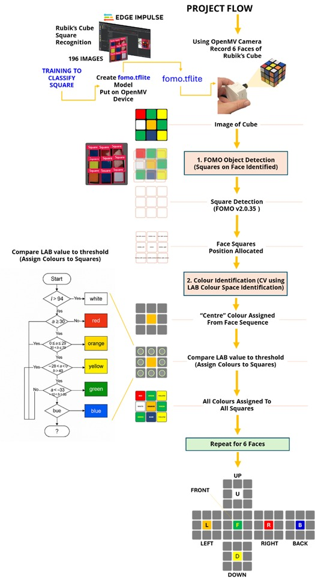
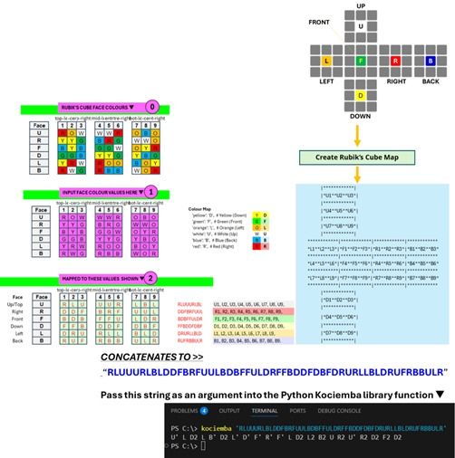
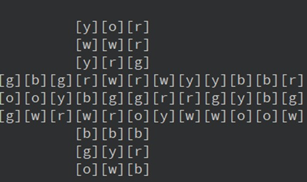
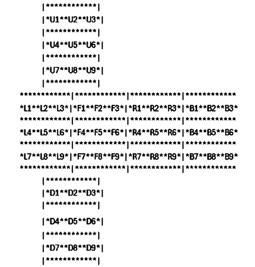
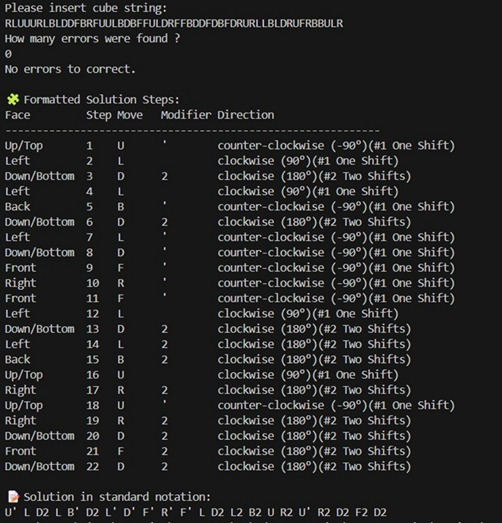
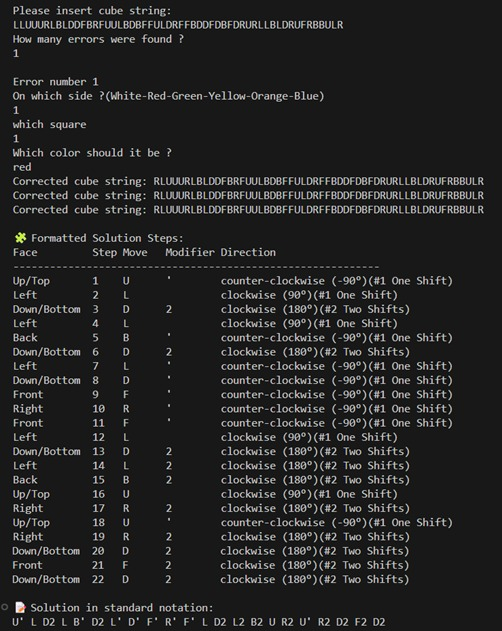
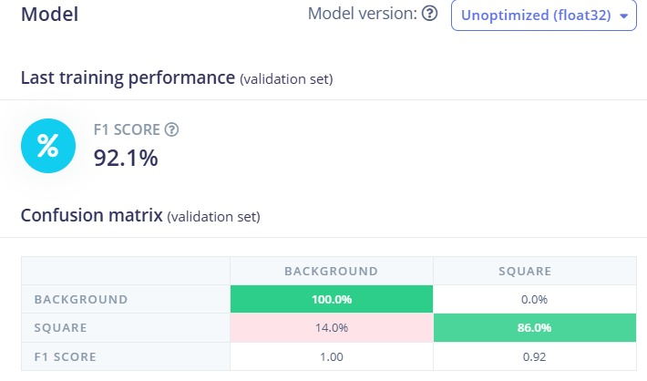
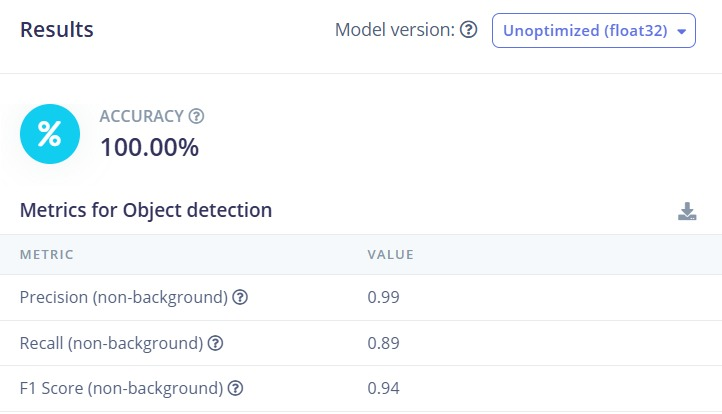
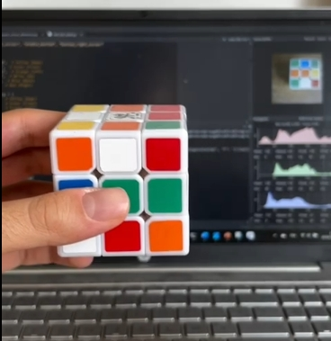

# Project EE6008 for group 7

# 🧊 Rubik's Cube Face Scanner and Solver - OpenMV + Python

This project scans and maps all six faces of a **Rubik’s Cube** using an **OpenMV camera** running object detection and color recognition. It produces a string representation of the cube's state and, if valid, outputs the steps to solve it.

---

## Table of Contents
- [Project Architecture](#project-architecture)
- [Project Files](#project-files)
- [Overview](#📷-overview)
- [Face Scanning Order](#🧠-face-scanning-order)
- [Files and Purpose](#🧾-files-and-purpose)
- [How It Works](#💡-how-it-works)
- [Requirements](#🛠️-requirements)
- [Installation and Setup](#installation-and-setup)
- [Example Output](#🧪-example-output)
- [Example Results](#📊-example-results)
- [Example Execution](#📽️-example-execution)

---


## Project Architecture

<div align="center">

<table>
  <tr>
    <td align="center">
      <br>
      <strong>Fig 1:</strong> Project flow chart.
    </td>
    <td align="center">
      <br>
      <strong>Fig 2:</strong> Mapping faces to 54-character Kociemba input string.
    </td>
  </tr>
</table>

</div>


---

## Project Files

```text
├── rubiks_square_color.py    # OpenMV color classification and face capture
├── error_handling.py         # Cube string validation and solving
├── fomo.tflite               # CNN model for color fallback (optional)
├── fomo_labels.txt           # Labels for the CNN model (optional)
├── screenshots_cube/         # Dataset of cube images for training/testing
└── README.md                 # Project documentation
```

---

## 📷 Overview

The system is designed to detect and classify the **colors of each face** of a Rubik’s Cube using:

- A **bounding box model** (FOMO) to detect the 9 squares on a face
- **LAB color detection** for accurate color classification
- Cube scanning in a fixed **face order**
- String output matching standard cube notation

---

## 🧠 Face Scanning Order

To ensure consistent orientation, scan the cube in the **following order**:

1. **White**
2. **Green**
3. **Yellow**
4. **Red**
5. **Blue**
6. **Orange**

The proper orientation of the cube should be kept in order to capture the sides with the proper orientation

This ensures the resulting cube string uses the standard notation:

UUUUUUUUURRRRRRRRRFFFFFFFFFDDDDDDDDDLLLLLLLLLBBBBBBBBB

Where:
- U = Up (White)
- R = Right (Red)
- F = Front (Green)
- D = Down (Yellow)
- L = Left (Orange)
- B = Back (Blue)

---

## 🧾 Files and Purpose

### `rubiks_square_color.py`

- Runs on the OpenMV camera
- Detects squares on a cube face using object detection
- Extracts a square region around each bounding box
- Classifies color using **LAB color rules**
- Captures one face per run and maps the 9 colors to a string
- Repeats for all 6 faces, forming a full 54-character cube string

---

### `error_handling.py`

- Takes the cube string output from `rubiks_square_color.py`
- Validates the cube structure and color distribution
- If correct: returns a list of moves to solve the cube
- If incorrect: prompts the user for corrections and generates a corrected string before solving

---

## 💡 How It Works

1. **Start scanning with `rubiks_square_color.py`**
   - Ensure good lighting and stable positioning
   - The script will:
     - Detect 9 squares
     - Force the color of the center and detect the remaining 8
     - Save the face image and print the identified colors

2. **After scanning all 6 faces**, run `error_handling.py`
   - Outputs a cube string to pass to the solver (i.e Kociemba)

   Then give this output to **error_handling.py**
   - If valid: Solves the cube using a solving library (e.g., `kociemba`) and returns instructions 
   - If errors: Prompts Asks the user to identify the error so it can apply a correction, then returns the instructions with the correct output

---

## 🛠️ Requirements

### Hardware
- [OpenMV Cam](https://openmv.io/)
- Lighting for consistent color detection

### Software
- OpenMV IDE for uploading `rubiks_square_color.py`
- Terminal to run `error_handling.py`
- Python 3.x with:
  - `kociemba` (or any solver library)
  - Standard libraries

---

## Installation and Setup

### Step 1: Clone the Repository
```bash
git clone https://github.com/g00ab/EE6008_G7.git
```

### Step 2: Navigate to the Project Directory
```bash
cd EE6008_G7
```

### Step 3: Install Required Python Packages
```bash
pip install -r requirements.txt
```

### Step 4: Run Error Handling Module Or Run Cube Face Detection Script on OpenMV

```bash
python error_handling.py  # Validates and solves the cube string

python rubiks_square_color.py  # Runs color classification and face capture
```

---

## 🧪 Example Output

```bash
🔎 LAB → CNN Color classification:

top_left_corner @(90, 48) → blue (1.00)
...
✅ Captured and saved side_1.jpg with center color 'white'

Cube string:
UUUUUUUUURRRRRRRRRFFFFFFFFFDDDDDDDDDLLLLLLLLLBBBBBBBBB

✅ Cube is valid. Solving...
Moves: R U R' U' R U2 R' ...

```

---


## 📊 Example Results

<div align="center">

<table>
  <tr>
    <td align="center">
      <br>
      <strong>Fig 3:</strong> Cube map output used to check for errors.
    </td>
    <td align="center">
      <br>
      <strong>Fig 4:</strong> Kociemba solver string context map.
    </td>
  </tr>
</table>

</div>

<div align="center">

<table>
  <tr>
    <td align="center">
      <br>
      <strong>Fig 5:</strong> Converting the Kociemba solver output into human readable instructions.
    </td>
    <td align="center">
      <br>
      <strong>Fig 6:</strong> Output generated by the error correction module.
    </td>
  </tr>
</table>

</div>

<div align="center">

<table>
  <tr>
    <td align="center">
      <br>
      <strong>Fig 7:</strong> Confusion matrix (validation set).
    </td>
    <td align="center">
      <br>
      <strong>Fig 8:</strong> Performance metrics – Square detection.
    </td>
  </tr>
</table>

</div>


---


## 📽️ Example Execution

<div align="center">

<table>
  <tr>
    <td align="center">
      <a href="https://drive.google.com/file/d/1xhpVf3gg67Sx7ZRB8k8-nPYWaYDNX7O1/view">
        <br>
        <strong>Vid 1:</strong> Showcasing how the error correction file works
      </a>
    </td>
    <td align="center">
      <a href="https://drive.google.com/file/d/1CkpWXyXSY68mPVyWUvkY5Cr8gL6HUlHF/view">
        <br>
        <strong>Vid 2:</strong> Implementation of the output string on an actual cube
      </a>
    </td>
  </tr>
</table>

</div>


---


